  <b>🇺🇸 English</b> &nbsp;·&nbsp; <a href="https://github.com/jonatasmota404/jonatasmota404/blob/main/README.pt.md">🇧🇷 Português</a>

  

  
  
  

I'm **Jônatas** — a fullstack engineer who leans backend. I write Node.js/TypeScript and Go for a living, ship React/Next.js when the job needs a frontend, and spent more than three years in professional PHP before that.

The work that defines me most right now isn't a side project. It's a system a real business depends on every day.

### The system I run

Since **November 2023** I've designed, built and maintained the management system for **Retífica Exacta de Motores**, my family's engine remanufacturing business. It's not a study project. The shop runs on it every day, and I'm also part of the team that runs the business itself.

That means I see both sides of every bug: I'm the one who ships the fix, and I'm also on the operations side when something breaks. Working that way has made me care a lot about data integrity, predictable deploys and code that's easy to reason about.

### Where I've been

| | |
|---|---|
| **Now** | Engineer behind Retífica Exacta's management system (Nov 2023 – present), in production with real operational stakes |
| **Before** | 3+ years of professional PHP, building backend for ~70 active clients at an accounting/fintech startup |
| **Education** | B.Sc. in Computer Science, IFMA (Instituto Federal do Maranhão) |
| **Based in** | Brazil 🇧🇷, open to **remote** fullstack, backend and DevOps roles |

### What I work with

**Backend:**

**Frontend:**

**Learning now:**

Go is something I've run in production, not a side experiment. I'm studying Docker, AWS and CI/CD now to round out the fullstack profile with solid infrastructure skills.

### Writing

I write about backend, infrastructure and what I've learned from keeping a real production system running. You'll find the posts on my **[portfolio & blog](https://jonatas.pro)**.

<b>GitHub activity</b>

 

  
  

---

  Hiring for remote fullstack, backend or DevOps work? Email me at <a href="mailto:jonatasjr.019@gmail.com">jonatasjr.019@gmail.com</a> or find me on <a href="https://www.linkedin.com/in/jonatas-jr/">LinkedIn</a>.

