  <a href="https://github.com/jonatasmota404/jonatasmota404/blob/main/README.md">🇺🇸 English</a> &nbsp;·&nbsp; <b>🇧🇷 Português</b>

  

  
  
  

Sou o **Jônatas**, engenheiro fullstack com foco em backend. Trabalho com Node.js/TypeScript e Go, entrego React/Next.js quando o projeto pede frontend e, antes disso, passei mais de três anos com PHP profissionalmente.

O trabalho que mais me define hoje não é um projeto paralelo. É um sistema do qual uma empresa real depende todos os dias.

### O sistema que eu mantenho

Desde **novembro de 2023** projeto, construo e mantenho o sistema de gestão da **Retífica Exacta de Motores**, empresa de retífica de motores da minha família. Não é projeto de estudo. A operação roda nele todo dia, e eu também faço parte da equipe que toca o negócio.

Por isso vejo os dois lados de cada bug: sou eu quem sobe a correção e também sou eu que estou na operação quando algo quebra. Trabalhar assim me fez dar muito valor a integridade de dados, deploys previsíveis e código fácil de entender.

### Trajetória

| | |
|---|---|
| **Hoje** | Engenheiro por trás do sistema de gestão da Retífica Exacta (nov/2023 – atual), em produção e com consequências reais para a operação |
| **Antes** | Mais de 3 anos de PHP profissional, desenvolvendo backend para cerca de 70 clientes ativos em uma startup de contabilidade/fintech |
| **Formação** | Bacharel em Ciência da Computação pelo IFMA (Instituto Federal do Maranhão) |
| **Onde estou** | Brasil 🇧🇷, aberto a vagas **remotas** de fullstack, backend e DevOps |

### Com o que eu trabalho

**Backend:**

**Frontend:**

**Estudando agora:**

Go eu já rodei em produção, não é experimento paralelo. Estou estudando Docker, AWS e CI/CD agora para completar o perfil fullstack com uma base sólida de infraestrutura.

### Escrita

Escrevo sobre backend, infraestrutura e o que aprendi mantendo um sistema real em produção. Os textos estão no meu **[portfólio e blog](https://jonatas.pro)**.

<b>Atividade no GitHub</b>

 

  
  

---

  Contratando para uma vaga remota de fullstack, backend ou DevOps? Me mande um e-mail em <a href="mailto:jonatasjr.019@gmail.com">jonatasjr.019@gmail.com</a> ou me encontre no <a href="https://www.linkedin.com/in/jonatas-jr/">LinkedIn</a>.

